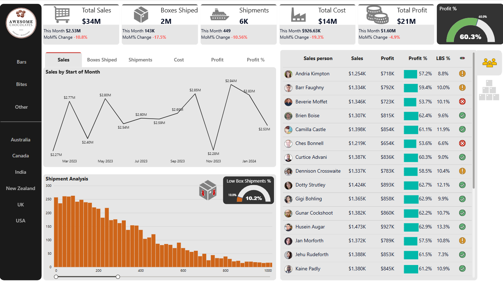

# Data-Analyst-Portfolio
Welcome! Here you'll see samples of my work along with tutorial projects I had worked on.

Sales Performance Dashboard (Power BI)

This dashboard provides insights into:

Revenue and profit trends over time

Shipment volume and distribution patterns

Salesperson performance and efficiency

🔧 Tools Used

Power BI

DAX

Excel

📌 Key Insights
Profit margin stands at 60.3%, indicating strong cost efficiency
Certain salespersons consistently outperform in both revenue and margin
Shipment volume shows a declining trend across the observed period

🖼️ Dashboard Preview

See the full Dashbobard here - [Power BI App Link](https://app.powerbi.com/view?r=eyJrIjoiNWI0MjE2NDQtYzZkMy00N2JlLWE4NzUtZThiZGJiMTVmNjhkIiwidCI6IjU4MTgxNmIyLWMwYmUtNGVhYS04MGUzLTI5ZTVmMjQ4NjQ5NCIsImMiOjh9)

